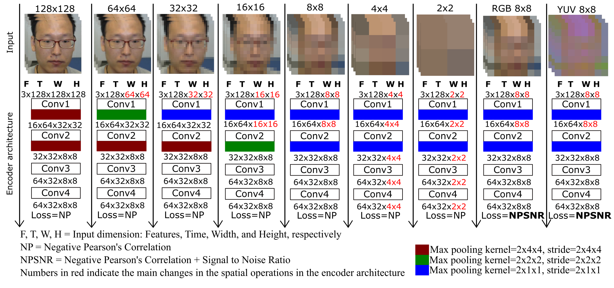
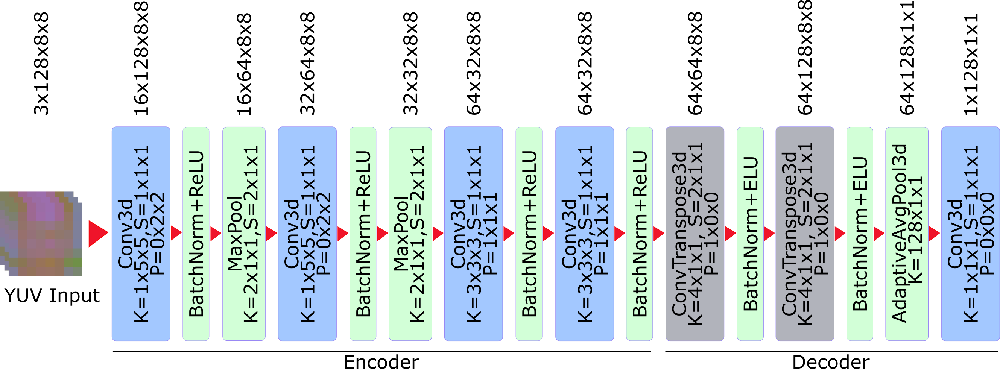
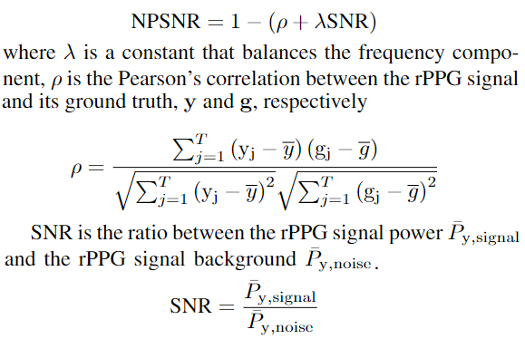
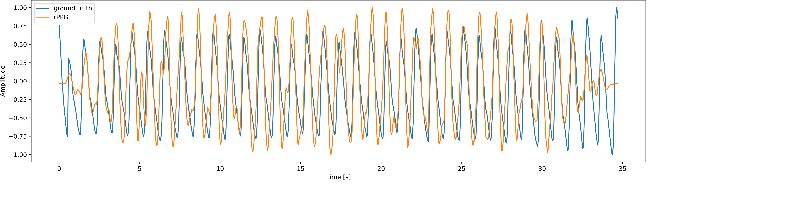

# Codebase for "3DCNN-based Real-Time rPPG network (RTrPPG)"

Original paper: [\[Paper link\]](https://drive.google.com/file/d/1lLTerHpAx0w3Xg2QxZCuI6wAxpuC0TCH/view?usp=sharing). 



## Model

#### 3DCNN RTrPPG architecture:



#### Time-frequency based loss function NPSNR:




## Installation
To install an anaconda virtual enviroment with the dependencies, you can run in your anaconda prompt:
```sh
conda env create -f \...\rtrppg\rtrppg_env.yaml
```

### Build
This project was tested with :
- Windows 10
- Anaconda 4.12.0
- Python 3.9.12
- Pytorch 1.10.2

## Usage

### RTrPPG demo
This demo uses the RTrPPG network trained on the VIPL-HR database [1] to generate an RPPG signal from a video of dimensions: Batch=1, Channels=3 (YUV), Time=128, Width = 8, Height = 8. The demo runs on CPU only so that it works on all hardware. However, changing the code to work on GPU is really easy (note to install the respective packages to work on GPU).

Inside the repository folder run the following command line:
```sh
python demo.py --run rtrppg_demo
```

This demo generates the resulting RPPG signal and saves it in the repository folder as "Output.png."



## Citation

If you find this code helpful in any way, please cite our paper:

    @inproceedings{botina2022rtrppg,
        title={RTrPPG: An Ultra Light 3DCNN for Real-Time Remote Photoplethysmography},
        author={Botina-Monsalve, Deivid and Benezeth, Yannick and Miteran, Johel},
        booktitle={Proceedings of the IEEE/CVF Conference on Computer Vision and Pattern Recognition},
        pages={2146--2154},
        year={2022}
    }

RTrPPG is for research purposes only, and commercial use is not allowed.

## Acknowledgments

- The example video used belong to the VIPL-HR database proposed by Niu, Xuesong, et al [1]. 
- The baseline network was based on the following repository: https://github.com/ZitongYu/PhysNet

## References
[1] Niu, Xuesong, Hu Han, Shiguang Shan, and Xilin Chen. "VIPL-HR: A multi-modal database for pulse estimation from less-constrained face video." In Asian conference on computer vision, pp. 562-576. Springer, Cham, 2018.

